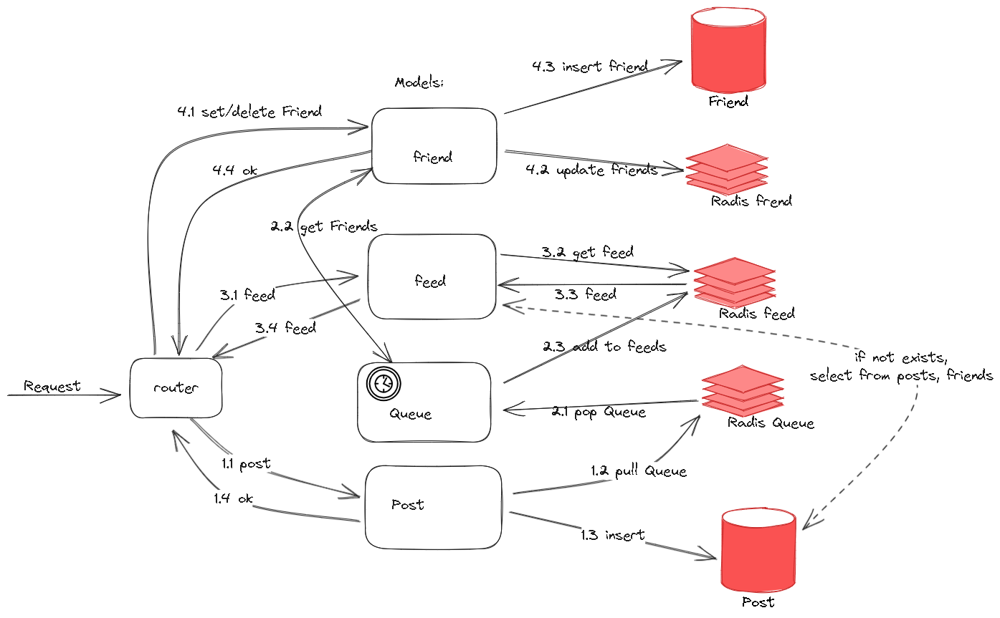

# OTUS-SoNet

Прототип социальной сети для обучения по курсу Highload Architect

## Реализованы методы:
* /login
* /user/register
* /user/get/{id}
* /user/search
* /friend/set/{user_id}
* /friend/delete/{user_id}
* /friend/get/{user_id}
* /test/test
* /health
* /metrics

Используйте [POSTMAN коллекцию](https://github.com/skalentev/OTUS-SoNet/blob/main/OTUS-SoNet.postman_collection.json) для тестирования


## Схема приема сообщений



## Требования к ПО для сборки и тестирования
- Go v1.18 or higher
- MySQL или Docker
- Git

## Запуск в Windows
1. Поднять БД MySQL (можно в докере, инструкция ниже)
2. Скачать репозиторий 
```bash
git clone https://github.com/skalentev/OTUS-SoNet
```
3. Перейти в папку с бинарником
   <code>cd OTUS-SoNet/bin</code>

4. в .env указать параметры подключекния к БД MySQL
5. Запуск
<code>./otus-sonet.exe</code>
6. Сервис поднимается на порту http://localhost:8080


## Запуск в Ubuntu
```bash
sudo apt install golang-go
git clone https://github.com/skalentev/OTUS-SoNet
cd OTUS-SoNet/
sudo docker compose up -d
go mod tidy
go test .
go run .
```

## Release Update
```bash
git pull
sudo docker build --no-cache -t sonet .
sudo docker compose down
sudo docker compose up -d
sudo docker logs -f sonet
```


## Поднять MySQL в докере
```bash
git clone https://github.com/skalentev/OTUS-SoNet
cd OTUS-SoNet
sudo docker compose up -d
```

## Запуск в Go
```bash
git clone https://github.com/skalentev/OTUS-SoNet
cd OTUS-SoNet
go mod tidy
go test .
go run main.go
```

## Сборка приложения
```bash
git clone https://github.com/skalentev/OTUS-SoNet
cd OTUS-SoNet
go mod tidy
go test .
go build -o bin .
```

## Загрузка тестовых данных
### MySQL:
в файле people.csv через notepad++ произвести замены:
```bash
"^(\w+) (\w+)" => "\2,\1"
```

В клиенте необходимо выполнить команды:
```sql
 SET GLOBAL local_infile=1;
 USE test1; 
 LOAD DATA LOCAL INFILE "/var/lib/mysql-files/people.csv" 
     INTO TABLE user 
     COLUMNS TERMINATED BY ',' 
     LINES TERMINATED BY '\n' 
     IGNORE 1 LINES 
     (first_name, second_name @age, city) 
     SET id = UUID(), birthdate = date_sub(current_date(),INTERVAL @age YEAR);
```
### PostgreSQL:
в файле people.csv через notepad++ произвести замены:
```bash
"^(\w+) (\w+)" => "\2,\1"
```
В PostgreSQL необходимо добавить
```sql
CREATE EXTENSION IF NOT EXISTS "uuid-ossp";
ALTER TABLE user ALTER COLUMN id SET DEFAULT uuid_generate_v4();
```

```sql
copy public.user (first_name, second_name, birthdate, city) 
    FROM 'people_pg.csv' 
    DELIMITER ',' 
    CSV HEADER ENCODING 'UTF8';

UPDATE public.user u SET  birthdate = date(current_timestamp) - (INTERVAL '1y')*to_number(u.birthdate,'999');

```

